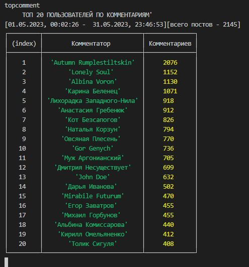

консольное приложение для подсчета статистики в группах vk.com
позволяет посчитать количество постов, топ  постов по коментариям и лайкам, топ пользователей по коментариям за заданный промежуток времени
образец  .env файла в example.env

для старта - npm run run

web интерфейс - http://localhost:4000/
 

комманды:
 

https://oauth.vk.com/authorize?client_id=51744768&display=page&redirect_uri=https://oauth.vk.com/blank.html&scope=friends,notify,photos,wall,email,mail,groups,stats,offline&response_type=token&v=5.74  пример ссылки для получения access token

